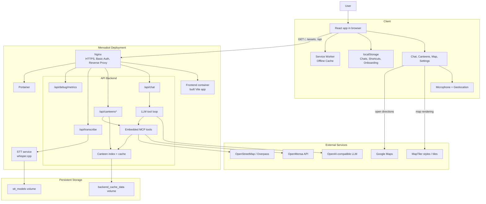

# Mensabot

<p align="center">
  
</p>

<p align="center">
  A bilingual canteen assistant for OpenMensa university cafeterias.<br>
  Mensabot combines live canteen data, map search, voice input, and an LLM-powered chat UI in one deployable stack.
</p>

## What Mensabot Is

Mensabot is a student project from the TU Berlin Quality and Usability Lab. It helps users find canteens, inspect menus, ask natural-language questions about food and opening hours, and navigate to nearby locations.

Its main product focus is German university canteens, but the technical design is intentionally broader: Mensabot works against OpenMensa-supported canteens in general. That means if a local canteen is not yet covered, adding a scraper or data pipeline that publishes its menu data to OpenMensa makes it automatically usable in Mensabot as well.

The project is built as a full stack application:

- A React frontend for chat, canteen browsing, maps, shortcuts, onboarding, and settings
- A FastAPI backend that talks to an OpenAI-compatible LLM
- An in-process MCP tool layer for OpenMensa, date context, disambiguation, and directions
- A local speech-to-text service based on `whisper.cpp`
- An Nginx reverse proxy with HTTPS, optional basic auth, and Portainer access

## Features

- Natural-language chat for menus, prices, opening hours, and canteen discovery
- Live canteen data based on OpenMensa and OpenStreetMap/Overpass
- Designed for 1,000+ OpenMensa-supported canteens
- Interactive disambiguation with location requests and single- or multi-choice clarification buttons
- Voice input with local speech-to-text transcription
- Map view with MapLibre and custom MapTiler styles
- Saved chat sessions and reusable prompt shortcuts in the browser
- Current language support in German and English
- PWA-style frontend with service worker caching and offline fallback page
- Docker-based deployment with HTTPS and optional basic authentication

## Architecture



## Repository Layout

```text
.
|-- frontend/                    React + TypeScript + Vite app
|-- backend/
|   |-- apps/api_backend/        FastAPI app + LLM tool-calling loop
|   |-- apps/stt_server/         Local whisper.cpp transcription service
|   |-- apps/mcp-server/         FastMCP tool server package
|   `-- libs/openmensa/          Typed Python SDK for OpenMensa
|-- nginx/                       Reverse proxy, TLS, basic auth bootstrap
|-- setup/                       Interactive setup wizard and certificate helper
|-- docker-compose.yml           Full deployment stack
|-- install.sh                   Bootstrap and management entry point
`-- .env.example                 Complete configuration reference
```

## Tech Stack

- Frontend: React 19, TypeScript, Vite, styled-components, i18next, MapLibre
- Backend: Python 3.11, FastAPI, FastMCP, OpenAI Python SDK, httpx
- Speech-to-text: `whisper.cpp` + FastAPI wrapper
- Data sources: OpenMensa API v2, OpenStreetMap Overpass API
- Deployment: Docker Compose, Nginx, Portainer

## Quick Start

### Option A: Setup and Management Wizard

For a fresh Linux VM or server, especially Debian/Ubuntu-based hosts, the simplest path is the interactive setup wizard:

```bash
curl -sSL https://raw.githubusercontent.com/tobiasv1337/Mensabot/main/install.sh | bash
```

What it does:

- Installs missing system dependencies on Debian/Ubuntu-based systems
- Installs Docker if needed
- Lets you select a release tag or branch before cloning or updating the repository
- Clones or updates the repository at the selected ref
- Creates a dedicated Python environment for the setup UI
- Launches the interactive setup wizard for configuration and deployment

Re-running the same command later is supported. If Mensabot is already present, `install.sh` reuses that checkout and reopens the same management menu so you can reconfigure settings, start, stop, restart, or update the deployment.

If you are already inside the repository, you can reopen that menu directly with:

```bash
bash install.sh
```

This path is the best choice for first-time deployments and ongoing operations. More details are in [SETUP_README.md](SETUP_README.md).

### Option B: Manual Docker Compose

If you want to run the stack yourself without the wizard:

1. Copy the environment template:

```bash
cp .env.example .env
```

2. Edit `.env` and set at least:

- `API_BACKEND_LLM_BASE_URL`
- `API_BACKEND_LLM_MODEL`
- `API_BACKEND_LLM_API_KEY`

3. If you do not already have TLS files at `nginx/certs/selfsigned.crt` and `nginx/certs/selfsigned.key`, generate development certificates:

```bash
bash setup/create-dev-cert.sh
```

The generated certificate is intended for `https://localhost` and `https://127.0.0.1`.
If users open Mensabot via a public hostname or IP address, either replace it with a trusted
certificate or regenerate the self-signed certificate with the matching public hostname/IP in `.env`.
If you already have `nginx/certs/selfsigned.crt` and `nginx/certs/selfsigned.key`, regenerate them
after changing those settings so the new names are actually embedded into the certificate.

4. Build and start the stack:

```bash
docker compose up --build -d
```

5. Open the app:

- App: `https://localhost/`
- Healthcheck: `https://localhost/api/health`
- Portainer (localhost/private network only): `https://localhost/portainer/`

If you are using the generated self-signed certificate, your browser will show a warning until you trust or replace it.

## Configuration Overview

All configuration lives in `.env`. The complete reference is documented inline in [.env.example](.env.example).

### Core Variables

| Variable | Required | Purpose |
|---|---|---|
| `API_BACKEND_LLM_BASE_URL` | Yes | OpenAI-compatible base URL, for example OpenRouter or another compatible provider |
| `API_BACKEND_LLM_MODEL` | Yes | Exact model identifier used for chat completions |
| `API_BACKEND_LLM_API_KEY` | Yes | API key for the configured LLM provider |
| `VITE_API_BASE_URL` | Recommended | Frontend API base path, default is `/api` |
| `VITE_MAPTILER_STYLE_URL_LIGHT` | Recommended | Light map style URL for the map page |
| `VITE_MAPTILER_STYLE_URL_DARK` | Recommended | Dark map style URL for the map page |
| `BASIC_AUTH_USER` / `BASIC_AUTH_PASS` | Optional | Enables Nginx basic authentication for the whole deployment |
| `MENSABOT_TLS_CN` | Optional | Public hostname or IP for the generated self-signed development certificate |
| `STT_MODEL` | Optional | Whisper model size such as `tiny`, `base`, `small`, or `medium` |
| `MENSA_MCP_TIMEZONE` | Optional | Timezone used for date resolution and prompts |

### Notes

- The chat experience depends on the LLM settings being valid.
- The map page needs both MapTiler style URLs. If they are empty, the rest of the app still works, but the map page shows a configuration error.
- In Docker, the canteen index and shared backend cache are persisted automatically to the `backend_cache_data` volume.
- The OpenMensa and Overpass user-agent settings in `.env.example` are optional overrides. If they are left unset, Mensabot derives them from the root `VERSION` file automatically.
- The frontend consumes environment values at build time. If you change frontend-facing variables, rebuild the image.

### Versioning

- The root [`VERSION`](VERSION) file is the single source of truth for the current Mensabot version.
- The shared backend cache and persisted canteen index both embed that version and are invalidated automatically when it changes.
- Default OpenMensa and Overpass user agents are also derived from `VERSION` unless you override them explicitly in `.env`.
- After changing `VERSION`, run:

```bash
python3 backend/scripts/sync_versions.py
```

- The sync script updates Python package versions and frontend package metadata. It does not rewrite your real `.env`.

## Running Locally for Development

### Prerequisites

- Node.js 20
- Python 3.11
- [`uv`](https://docs.astral.sh/uv/)
- Docker, if you want to test the STT service or the full stack

### Frontend + Backend

1. Copy the environment file and add your LLM credentials:

```bash
cp .env.example .env
```

2. Start the API backend:

```bash
cd backend/apps/api_backend
uv sync
uv run mensa-api-backend
```

3. In a second terminal, start the frontend:

```bash
cd frontend
npm ci
npm run dev
```

4. Open:

```text
http://localhost:5173
```

The Vite dev server proxies `/api` requests to `http://localhost:8000`, and the backend already allows local CORS origins for common dev ports.

### Voice Input in Local Dev

Text chat works without the STT service. Voice input only needs STT when the browser sends audio to `/api/transcribe`.

The easiest path is to run the full Docker stack. If you only want STT while the frontend and API run locally, note that the compose file does not publish port `9100` to the host by default. Add a temporary mapping such as:

```yaml
ports:
  - "127.0.0.1:9100:9100"
```

to the `stt` service, then point the backend at it:

```bash
export API_BACKEND_STT_BASE_URL=http://127.0.0.1:9100
```

See [backend/apps/stt_server/README.md](backend/apps/stt_server/README.md) for service-specific notes.

## Docker Services

The default `docker-compose.yml` starts these services:

- `frontend`: serves the production React build on port `8080` inside the Compose network
- `backend`: FastAPI API on port `8000` inside the Compose network
- `stt`: whisper.cpp-based transcription service on port `9100` inside the Compose network
- `nginx`: public reverse proxy exposing ports `80` and `443`
- `portainer`: Docker management UI available under `/portainer`

Persistent volumes:

- `stt_models`: caches downloaded whisper models
- `backend_cache_data`: stores the generated canteen index and the shared backend cache
- `portainer_data`: stores Portainer state

## API Overview

The backend exposes the following HTTP endpoints:

| Method | Path | Purpose |
|---|---|---|
| `GET` | `/api/health` | Basic healthcheck |
| `POST` | `/api/chat` | LLM chat endpoint with MCP-backed tool calling |
| `POST` | `/api/transcribe` | Speech-to-text transcription for voice input |
| `GET` | `/api/canteens` | Paginated canteen list |
| `GET` | `/api/canteens/search` | Search canteens by text and optional proximity |
| `GET` | `/api/canteens/{canteen_id}` | Canteen metadata |
| `GET` | `/api/canteens/{canteen_id}/menu` | Menu for a specific canteen and date |
| `GET` | `/api/canteens/{canteen_id}/opening-hours` | Opening hours resolved from OSM data |
| `GET` | `/api/debug/metrics` | Debug metrics endpoint, only when enabled |

The chat endpoint can return normal replies, location requests, clarification prompts, or directions prompts depending on what the backend tool loop needs to answer the user.

## How the Chat Layer Works

At a high level:

1. The frontend sends the message history and active user filters to `/api/chat`.
2. The API backend builds a localized system prompt and resolves current time context.
3. It fetches MCP tool schemas and calls an OpenAI-compatible chat completion API.
4. The model can invoke tools such as:
   - `search_canteens`
   - `get_menu_for_date`
   - `get_menus_batch`
   - `get_opening_hours_osm_for_canteen`
   - `get_date_context`
   - `request_user_location`
   - `request_user_clarification`
   - `request_canteen_directions`
5. The backend either continues the tool loop or returns a structured frontend action.

This design keeps the LLM focused on orchestration while live data comes from tools instead of the model's static knowledge.

## Operations and Deployment Notes

### HTTPS

- Nginx always redirects HTTP to HTTPS.
- The current implementation expects certificate files at these fixed paths:
  - `nginx/certs/selfsigned.crt`
  - `nginx/certs/selfsigned.key`
- The setup wizard auto-generates development certificates if they are missing.
- For a real deployment, replace those files with your trusted certificate and key contents.
- In practice that means copying:
  - `fullchain.pem` -> `nginx/certs/selfsigned.crt`
  - `privkey.pem` -> `nginx/certs/selfsigned.key`

### Basic Authentication

If both `BASIC_AUTH_USER` and `BASIC_AUTH_PASS` are set, the Nginx container generates an `.htpasswd` file automatically and protects the deployment with HTTP basic auth.

### Portainer

Portainer is included behind the same Nginx entrypoint and is reachable under `/portainer/`, but the reverse proxy now restricts it to localhost plus common private-network ranges by default. That keeps the container management UI off the public internet while still allowing access from the host machine, LAN clients, and typical VPN/CGNAT networks such as Tailscale. If your admin network uses different client IP ranges, adjust the `allow` rules in `nginx/nginx.conf`.

## Quality and CI

GitHub Actions currently cover:

- Frontend dependency install and production build
- Python dependency sync and source compilation for:
  - `backend/libs/openmensa`
  - `backend/apps/mcp-server`
  - `backend/apps/api_backend`
- Optional `pytest` runs if a package contains a `tests/` directory
- API backend healthcheck against `/api/health`

There is no dedicated frontend test suite checked in at the moment.

## Limitations and Caveats

- Menu quality depends on the upstream OpenMensa data for each institution.
- Opening hours are resolved from OpenStreetMap data and may be missing or ambiguous.
- Diet and allergen filtering is inferred and should not be treated as medically reliable.
- Voice transcription quality depends on the selected whisper model and available CPU resources.
- Browser-side chat history and shortcuts are stored locally in `localStorage`.
- The onboarding flow explicitly notes that Mensabot is a university research project and that usage data may be collected for evaluation. If you deploy Mensabot publicly, make sure your legal and privacy notices match how you operate it.

## Related Documentation

- [SETUP_README.md](SETUP_README.md): interactive setup wizard and deployment notes
- [backend/apps/stt_server/README.md](backend/apps/stt_server/README.md): STT service details
- [backend/libs/openmensa/README.md](backend/libs/openmensa/README.md): reusable OpenMensa SDK

## Project Status

Mensabot is an active student project and research prototype. The repository already contains a deployable full stack application, but it should still be treated like an evolving system rather than a finalized product.
