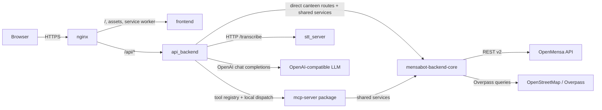
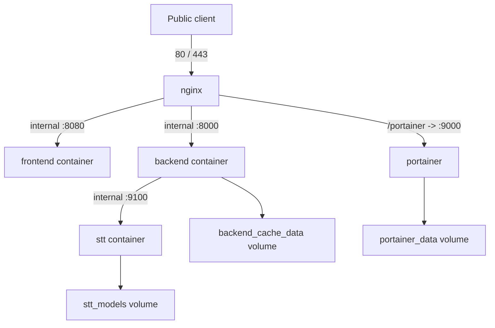
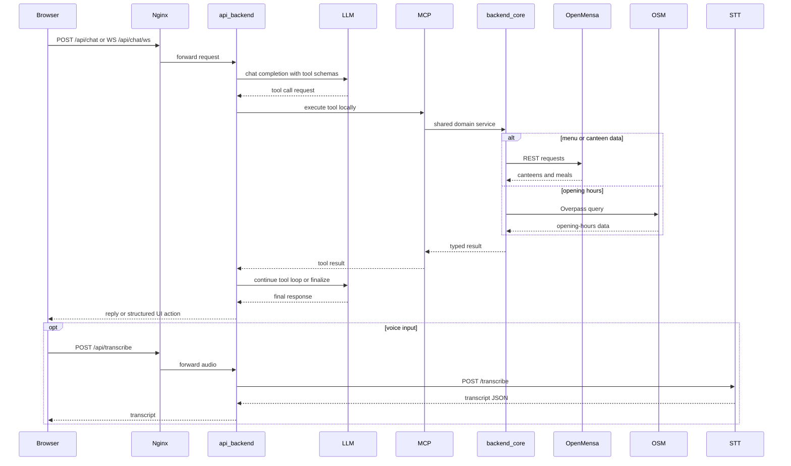

# Mensabot

<p align="center">
  
</p>

<p align="center">
  Bilingual canteen assistant for OpenMensa-backed university cafeterias.
  <br>
  Mensabot combines live menu data, map search, voice input, and an LLM-powered chat UI in one deployable stack.
</p>

## What is Mensabot

Mensabot is a student project from the TU Berlin Quality and Usability Lab.

It helps users:

- find university canteens
- inspect current menus and prices
- ask natural-language questions about food, dates, and opening hours
- compare canteens and menus
- navigate to nearby locations

The main product focus is German university canteens, but the technical design is broader: Mensabot works against OpenMensa-supported canteens in general. If a local canteen is not yet covered, adding a scraper or data pipeline that publishes its menu data to OpenMensa makes it available to Mensabot as well.

## Documentation Map

| Goal | README |
| --- | --- |
| Deploy Mensabot on a server or VM | [Setup README](setup/README.md) |
| Work on the React client | [Frontend README](frontend/README.md) |
| Understand the Python services and shared libraries | [Backend README](backend/README.md) |
| Inspect the FastAPI service | [API backend README](backend/apps/api_backend/README.md) |
| Inspect the MCP tool package | [MCP server README](backend/apps/mcp-server/README.md) |
| Inspect the speech-to-text service | [STT server README](backend/apps/stt_server/README.md) |

## Component Interfaces



## What Mensabot Does

- Natural-language chat for menus, prices, opening hours, and canteen discovery
- Live canteen data from OpenMensa plus opening-hours resolution from OpenStreetMap / Overpass
- Interactive map browsing with MapLibre and theme-specific MapTiler styles
- Browser-local chats, reusable shortcuts, onboarding, and install prompts
- Local speech-to-text via `whisper.cpp`
- Docker-based deployment with HTTPS, optional basic auth, and Portainer behind Nginx
- German and English UI and backend prompt support

## Runtime Architecture



## Chat Request Flow



## Repository Layout

```text
.
|-- README.md
|-- install.sh
|-- docker-compose.yml
|-- .env.example
|-- assets/                         Logos and shared artwork
|-- setup/                          Interactive setup wizard and TLS helper
|-- frontend/                       React + TypeScript + Vite web client
|-- backend/
|   |-- README.md
|   |-- Dockerfile
|   |-- apps/
|   |   |-- api_backend/           FastAPI app and LLM tool loop
|   |   |-- mcp-server/            FastMCP tool package
|   |   `-- stt_server/            whisper.cpp transcription service
|   |-- libs/
|   |   |-- mensabot-backend-core/ Shared domain services
|   |   |-- mensabot-common/       Version and user-agent helpers
|   |   `-- openmensa/             Typed OpenMensa SDK + canteen index
|   `-- scripts/                   Backend helper scripts
|-- nginx/                          HTTPS reverse proxy and auth bootstrap
`-- .github/workflows/              Frontend and backend CI
```

## Quick Start

### Option A: Interactive Setup and Operations

For a fresh Linux VM or server, the supported happy path is the interactive installer:

```bash
curl -sSL https://raw.githubusercontent.com/tobiasv1337/Mensabot/main/install.sh | bash
```

What this path does:

- bootstraps missing system packages on Debian/Ubuntu-style hosts
- installs Docker if it is missing
- lets you choose a tag or branch before cloning or updating
- creates `.setup-venv` for the setup UI
- launches the setup wizard for `.env`, TLS, and Docker Compose actions

If the repository already exists, rerunning the same command reopens the management flow instead of starting from scratch.

Details: [Setup README](setup/README.md)

### Option B: Manual Docker Compose

Use this when you want to manage the deployment yourself.

1. Create the environment file.

```bash
cp .env.example .env
```

2. Set the required LLM settings in `.env`.

```dotenv
API_BACKEND_LLM_BASE_URL=...
API_BACKEND_LLM_MODEL=...
API_BACKEND_LLM_API_KEY=...
```

3. Create development TLS files if you do not already have certificate files at `nginx/certs/selfsigned.crt` and `nginx/certs/selfsigned.key`.

```bash
bash setup/create-dev-cert.sh
```

4. Build and start the stack.

```bash
docker compose up --build -d
```

5. Open the deployment.

- App: `https://localhost/`
- API healthcheck: `https://localhost/api/health`
- Portainer: `https://localhost/portainer/`

The generated certificate is self-signed, so browsers will show a warning until you trust or replace it.

## Local Development

### Frontend + API backend

1. Copy the shared environment file.

```bash
cp .env.example .env
```

2. Start the API backend.

```bash
cd backend/apps/api_backend
uv sync
uv run mensa-api-backend
```

3. Start the frontend in a second terminal.

```bash
cd frontend
npm ci
npm run dev
```

4. Open `http://localhost:5173`.

The Vite dev server proxies `/api` to `http://localhost:8000`, so the default `VITE_API_BASE_URL=/api` works in both development and the default Nginx deployment.

### Voice input in local development

Text chat does not need the STT service. Voice input does.

The compose file keeps the STT service internal by default, so if you want host-run frontend and API plus containerized STT you need to temporarily publish `9100` and point the API backend at it:

```bash
export API_BACKEND_STT_BASE_URL=http://127.0.0.1:9100
```

Service details: [STT server README](backend/apps/stt_server/README.md)

## Configuration Overview

All runtime settings live in `.env`. The authoritative reference is [.env.example](.env.example).

| Variable | Required | Purpose |
| --- | --- | --- |
| `API_BACKEND_LLM_BASE_URL` | Yes | OpenAI-compatible provider base URL |
| `API_BACKEND_LLM_MODEL` | Yes | Chat completion model identifier |
| `API_BACKEND_LLM_API_KEY` | Yes | Provider API key |
| `VITE_API_BASE_URL` | Recommended | Frontend API base path, normally `/api` |
| `VITE_MAPTILER_STYLE_URL_LIGHT` | Required for map page | Light-mode style JSON URL |
| `VITE_MAPTILER_STYLE_URL_DARK` | Required for map page | Dark-mode style JSON URL |
| `BASIC_AUTH_USER` / `BASIC_AUTH_PASS` | Optional | Enables HTTP basic auth in Nginx |
| `MENSABOT_TLS_CN` / `MENSABOT_TLS_SANS` | Optional | Public hostnames or IPs for generated self-signed certs |
| `STT_MODEL` | Optional | Whisper model size such as `small` or `medium` |
| `MENSA_MCP_TIMEZONE` | Optional | Timezone used for date normalization and prompts |

Notes:

- Frontend variables are baked in at build time. Rebuild the frontend image after changing `VITE_*` values.
- `docker-compose.yml` overrides the canteen index and shared cache paths to `/data/...` so they survive container restarts.
- The default OpenMensa and Overpass user agents are derived from the root [`VERSION`](VERSION) file unless you override them.
- The map page needs both MapTiler URLs. The rest of the app still works without them.

## Compose Services

| Service | Role | Exposure |
| --- | --- | --- |
| `frontend` | Serves the compiled Vite app on port `8080` inside the Compose network | internal only |
| `backend` | Runs the FastAPI API on port `8000` inside the Compose network | internal only |
| `stt` | Runs the `whisper.cpp` transcription service on port `9100` inside the Compose network | internal only |
| `nginx` | Terminates TLS and reverse-proxies frontend, backend, and Portainer | public `80` and `443` |
| `portainer` | Docker management UI mounted under `/portainer/` | behind Nginx, private-network restricted |

Persistent volumes:

- `backend_cache_data` for the shared cache and canteen index
- `stt_models` for downloaded whisper models
- `portainer_data` for Portainer state

## Operational Caveats

- Menu quality depends on upstream OpenMensa data.
- Opening hours are resolved from OpenStreetMap and can be missing or ambiguous.
- Diet and allergen filtering is inferred from menu text and should not be treated as medical advice.
- Browser-side chats and shortcuts live in `localStorage`, not on the server.

## Versioning and CI

- [`VERSION`](VERSION) is the single source of truth for the project version.
- `backend/scripts/sync_versions.py` propagates that version into selected package manifests and frontend metadata.
- GitHub Actions currently cover frontend builds, backend package sync and compile checks, optional `pytest` runs when a package has tests, and an API healthcheck.

## Related README Files

- [Setup README](setup/README.md)
- [Frontend README](frontend/README.md)
- [Backend README](backend/README.md)
- [API backend README](backend/apps/api_backend/README.md)
- [MCP server README](backend/apps/mcp-server/README.md)
- [STT server README](backend/apps/stt_server/README.md)
