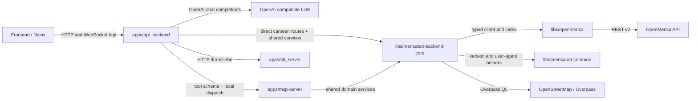
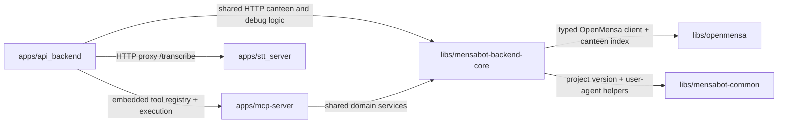

# Mensabot Backend

<p align="center">
  
</p>

> Docs: [Main README](../README.md) | [Setup README](../setup/README.md) | [Frontend README](../frontend/README.md) | [API backend](apps/api_backend/README.md) | [MCP server](apps/mcp-server/README.md) | [STT server](apps/stt_server/README.md)

The `backend/` directory contains the complete Python backend for Mensabot: deployable applications, shared libraries, and a few helper scripts for maintainers.

## Backend Architecture



## Python Package Graph



## What Lives Here

| Path | Type | Purpose |
| --- | --- | --- |
| [`apps/api_backend`](apps/api_backend/README.md) | App | Main FastAPI service for chat, streaming, canteen endpoints, and STT proxying |
| [`apps/mcp-server`](apps/mcp-server/README.md) | App or package | FastMCP tool surface used by the LLM and runnable standalone over stdio |
| [`apps/stt_server`](apps/stt_server/README.md) | App | Local `whisper.cpp`-based speech-to-text service |
| [`libs/mensabot-backend-core`](libs/mensabot-backend-core/README.md) | Library | Shared cache, settings, menu logic, OSM resolution, and index lifecycle |
| [`libs/openmensa`](libs/openmensa/README.md) | Library | Typed OpenMensa client and persistent fuzzy-search canteen index |
| [`libs/mensabot-common`](libs/mensabot-common/README.md) | Library | Shared version and user-agent helpers |
| [`scripts`](scripts/README.md) | Utilities | Backend helper scripts such as tool inspection and version syncing |

## Runtime Responsibilities

| Concern | Main component |
| --- | --- |
| Chat orchestration and API routes | `apps/api_backend` |
| Tool definitions for the LLM | `apps/mcp-server` |
| Menu, cache, and opening-hours logic | `libs/mensabot-backend-core` |
| Low-level OpenMensa HTTP access and canteen index | `libs/openmensa` |
| Local audio transcription | `apps/stt_server` |

## Request Paths

| User action | Backend path |
| --- | --- |
| Ask a chat question | frontend -> `apps/api_backend` -> LLM + embedded MCP tools |
| Browse or search canteens | frontend -> `apps/api_backend` -> `libs/mensabot-backend-core` -> OpenMensa |
| Resolve opening hours | frontend or tool call -> `apps/api_backend` / `apps/mcp-server` -> `libs/mensabot-backend-core` -> OSM / Overpass |
| Upload voice input | frontend -> `apps/api_backend` -> `apps/stt_server` |

## Configuration Surface

All backend processes read from `.env`, but each one uses a different subset.

| Process | Prefixes | Notes |
| --- | --- | --- |
| `apps/api_backend` | `API_BACKEND_*` directly, plus `MENSA_MCP_*` through imported packages | LLM settings, retry limits, debug endpoints, STT base URL |
| `apps/mcp-server` | `MENSA_MCP_*` | OpenMensa, Overpass, cache, canteen index, timezone |
| `apps/stt_server` | `STT_*` | Whisper runtime, upload limits, language, concurrency |

Important shared runtime notes:

- the API backend requires `API_BACKEND_LLM_BASE_URL`, `API_BACKEND_LLM_MODEL`, and `API_BACKEND_LLM_API_KEY`
- the API backend embeds `mensa-mcp-server`, so it also depends on the `MENSA_MCP_*` settings
- `docker-compose.yml` persists the shared cache and canteen index under `/data`
- the default `API_BACKEND_STT_BASE_URL=http://stt:9100` only works inside the Compose network

## Local Development

### Recommended host-run API backend

1. Copy `.env.example` to `.env`.
2. Make the STT service reachable from your host if you want `/api/transcribe` to work.
3. Start the API backend from its package directory.

```bash
cd backend/apps/api_backend
uv sync
uv run mensa-api-backend
```

The API listens on `http://127.0.0.1:8000`.

If the STT service runs on your host or on a published Docker port, point the API backend at it:

```bash
export API_BACKEND_STT_BASE_URL=http://127.0.0.1:9100
```

### Standalone MCP inspection

For tooling or debugging you can run the MCP package directly:

```bash
cd backend/apps/mcp-server
uv sync
uv run mensa-mcp-server
```

This starts the MCP server over stdio, which is useful for inspection and external MCP clients.

### Full containerized backend

To run the backend side the same way the main deployment does:

```bash
cp .env.example .env
docker compose up --build backend stt
```

This starts both services on the internal Compose network. They are not published to localhost by default.

## Docker Notes

There are two backend-related images in the default stack:

| Dockerfile | Purpose |
| --- | --- |
| [`Dockerfile`](Dockerfile) | Builds the main API backend image and installs the shared backend packages |
| [`apps/stt_server/Dockerfile`](apps/stt_server/Dockerfile) | Builds the STT image, compiles `whisper.cpp`, installs `ffmpeg`, and runs `mensa-stt-server` |

The MCP package is not deployed as a separate container in the default setup. The API backend imports it directly and uses it in-process.

## Why MCP Is Embedded

Mensabot uses MCP as the clean boundary for its tool definitions, but the default deployment keeps that tool package inside the same Python process space as the API backend. That keeps tool execution local, avoids another network hop, and lets the API backend translate the MCP tool registry directly into OpenAI tool definitions.

## Documentation Map

- [API backend](apps/api_backend/README.md)
- [MCP server](apps/mcp-server/README.md)
- [STT server](apps/stt_server/README.md)
- [Backend core library](libs/mensabot-backend-core/README.md)
- [OpenMensa SDK](libs/openmensa/README.md)
- [Common backend utilities](libs/mensabot-common/README.md)
- [Backend scripts](scripts/README.md)
