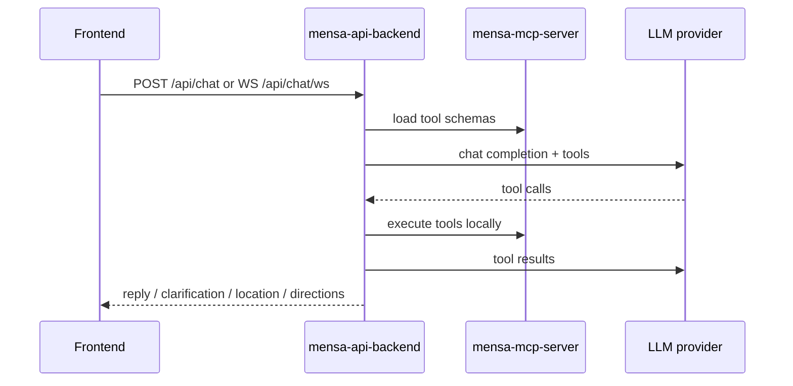

# mensa-api-backend

> Docs: [Main README](../../../README.md) | [Backend README](../../README.md) | [MCP server README](../mcp-server/README.md) | [STT server README](../stt_server/README.md) | [Backend core README](../../libs/mensabot-backend-core/README.md)

`mensa-api-backend` is the main HTTP API for Mensabot. It accepts chat requests from the frontend, orchestrates the LLM tool loop, exposes direct canteen endpoints, and proxies voice uploads to the STT service.

## Request Flow



## Responsibilities

- serve the frontend-facing HTTP and WebSocket API
- build localized system prompts and time context
- translate the embedded FastMCP registry into OpenAI tool definitions
- execute the tool loop with retry logic and optional LLM-as-a-judge validation
- expose canteen search, menu, and opening-hours endpoints for direct frontend use via shared `mensabot-backend-core` services
- forward voice uploads to `mensa-stt-server`

## API Surface

| Route | Method | Purpose |
| --- | --- | --- |
| `/api/health` | `GET` | Liveness check |
| `/api/chat` | `POST` | Non-streaming chat completion |
| `/api/chat/ws` | `WS` | Streaming chat with phases, heartbeats, and tool traces |
| `/api/transcribe` | `POST` | Speech-to-text proxy endpoint |
| `/api/canteens` | `GET` | Paginated canteen listing |
| `/api/canteens/search` | `GET` | Fuzzy canteen search with optional location constraints |
| `/api/canteens/{canteen_id}` | `GET` | Single canteen metadata |
| `/api/canteens/{canteen_id}/menu` | `GET` | Menu lookup for a specific date |
| `/api/canteens/{canteen_id}/opening-hours` | `GET` | Opening-hours resolution via OSM |
| `/api/debug/metrics` | `GET` | Hidden debug endpoint, only when enabled |

## Chat Request Model

The chat endpoints accept a request with these important fields:

| Field | Purpose |
| --- | --- |
| `messages` | Current user and assistant history |
| `include_tool_calls` | Include tool traces in the response |
| `filters` | Diet, allergen, canteen, and price filters |
| `language` | Preferred response language |
| `judgeCorrection` | Enable or disable the LLM-as-a-judge pass for this request |

The public chat response can end in one of four states:

| Status | Meaning |
| --- | --- |
| `ok` | Normal assistant reply |
| `needs_location` | The frontend should request user location |
| `needs_directions` | The frontend should show a directions action |
| `needs_clarification` | The frontend should render predefined clarification choices |

## Configuration

This process reads its own settings plus the shared MCP settings used by imported backend libraries.

| Prefix | Used here | Purpose |
| --- | --- | --- |
| `API_BACKEND_*` | Yes | LLM provider, retries, loop limits, debug toggles, STT proxy |
| `MENSA_MCP_*` | Yes, indirectly | OpenMensa, Overpass, cache paths, canteen index, timezone |
| `STT_*` | No | These belong to the separate STT service process |

Most important `API_BACKEND_*` variables:

| Variable | Required | Purpose |
| --- | --- | --- |
| `API_BACKEND_LLM_BASE_URL` | Yes | OpenAI-compatible provider base URL |
| `API_BACKEND_LLM_MODEL` | Yes | Chat completion model identifier |
| `API_BACKEND_LLM_API_KEY` | Yes | Provider API key |
| `API_BACKEND_LLM_TEMPERATURE` | No | Optional temperature override |
| `API_BACKEND_MAX_LLM_ITERATIONS` | No | Upper bound for the tool-calling loop |
| `API_BACKEND_MAX_HISTORY_MESSAGES` | No | History truncation per request |
| `API_BACKEND_LLM_JUDGE_ENABLED` | No | Enables the validation pass |
| `API_BACKEND_STT_BASE_URL` | No | Base URL of the STT service |
| `API_BACKEND_ENABLE_DEBUG_ENDPOINTS` | No | Enables `/api/debug/metrics` |

Settings are loaded from a local `.env` if present, or from the repository root `.env`.

## Local Run

```bash
cd backend/apps/api_backend
uv sync
uv run mensa-api-backend
```

By default the service listens on `0.0.0.0:8000`.

For local frontend development, CORS allows these common origins:

- `http://localhost:5173`
- `http://127.0.0.1:5173`
- `http://localhost:3000`
- `http://127.0.0.1:3000`

If you want `/api/transcribe` to work outside Docker Compose, make the STT service reachable from the host and override:

```bash
export API_BACKEND_STT_BASE_URL=http://127.0.0.1:9100
```

## Code Map

| Path | Role |
| --- | --- |
| `src/mensa_api_backend/app.py` | FastAPI app factory, routers, CORS, shared-cache lifecycle |
| `src/mensa_api_backend/routes/` | HTTP and WebSocket route handlers |
| `src/mensa_api_backend/tooling/loop.py` | Main LLM tool-calling loop |
| `src/mensa_api_backend/tooling/registry.py` | FastMCP to OpenAI tool schema translation |
| `src/mensa_api_backend/tooling/judge.py` | LLM-as-a-judge validation pass |
| `src/mensa_api_backend/services/` | API-facing adapters around shared backend services |
| `src/mensa_api_backend/locales/` | Backend prompt and response strings |

## Deployment Notes

- in Docker Compose this package is installed into the `backend` container together with the shared libraries and the MCP package
- the MCP package is imported in-process rather than contacted over the network
- non-tool canteen and debug endpoints call `mensabot-backend-core` directly; only the tool registry and tool execution path go through embedded MCP
- shared cache and canteen index persistence come from the `MENSA_MCP_*` configuration inside the same container

## Related README Files

- [Main README](../../../README.md)
- [Backend README](../../README.md)
- [MCP server README](../mcp-server/README.md)
- [STT server README](../stt_server/README.md)
