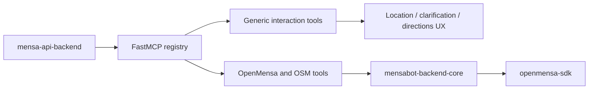

# mensa-mcp-server

> Docs: [Main README](../../../README.md) | [Backend README](../../README.md) | [API backend README](../api_backend/README.md) | [Backend core README](../../libs/mensabot-backend-core/README.md) | [OpenMensa SDK README](../../libs/openmensa/README.md)

`mensa-mcp-server` defines the tool surface that Mensabot exposes to the LLM. In the default deployment it is imported directly by the API backend, but it can also run standalone over stdio.

## Tool Layer Overview



## Why This Package Exists

This package keeps a clean boundary between:

- conversational orchestration in `mensa-api-backend`
- executable tools for search, menus, opening hours, and frontend UI actions

That separation makes the tool surface inspectable, reusable, and easier to evolve independently from the FastAPI layer.

## Registered Tools

### Generic interaction tools

| Tool | Purpose |
| --- | --- |
| `get_date_context` | Canonical timezone-aware date references |
| `health` | Simple operational check |
| `request_user_location` | Ask the frontend for user location |
| `request_canteen_directions` | Trigger a directions action |
| `request_user_clarification` | Render predefined clarification choices |

### OpenMensa and OSM tools

| Tool | Purpose |
| --- | --- |
| `search_canteens` | Search canteens by name, city, or proximity |
| `get_canteen_info` | Fetch a single canteen by ID |
| `get_menu_for_date` | Fetch one canteen menu with optional filters |
| `get_menus_batch` | Fetch multiple menus efficiently in one call |
| `get_opening_hours_osm_for_canteen` | Resolve opening hours from OSM / Overpass |

These tools are shaped for LLM use: typed schemas, deterministic input validation, and frontend-aware responses instead of brittle plain-text prompting.

## Embedded vs. Standalone Use

### Default Mensabot deployment

1. `mensa-api-backend` imports the package-local `mcp` object directly.
2. The API backend reads the registered FastMCP tools.
3. Tool schemas are translated into OpenAI tool definitions.
4. Tool calls are executed locally inside the same Python process space.

The API backend uses this package only for tool discovery and tool execution. Ordinary HTTP canteen routes and debug endpoints call `mensabot-backend-core` directly.

### Standalone mode

You can also run the package over stdio for:

- inspection and schema debugging
- connecting another MCP-capable client
- testing the tool surface in isolation

## Configuration

This package reads only `MENSA_MCP_*` settings.

| Setting area | Examples |
| --- | --- |
| OpenMensa | `MENSA_MCP_OPENMENSA_BASE_URL`, `MENSA_MCP_OPENMENSA_TIMEOUT` |
| Overpass / OSM | `MENSA_MCP_OVERPASS_URL`, `MENSA_MCP_OVERPASS_TIMEOUT` |
| Cache | `MENSA_MCP_SHARED_CACHE_PATH`, `MENSA_MCP_SHARED_CACHE_MAX_ITEMS` |
| Canteen index | `MENSA_MCP_CANTEEN_INDEX_PATH`, `MENSA_MCP_CANTEEN_INDEX_TTL_HOURS` |
| Timezone | `MENSA_MCP_TIMEZONE` |

It does not read `API_BACKEND_*`; those belong to the FastAPI app that embeds this package.

## Running It

### Directly with `uv`

```bash
cd backend/apps/mcp-server
uv sync
uv run mensa-mcp-server
```

### Via the helper script

```bash
cd backend/apps/mcp-server
bash run_mcp_server.sh
```

The entry point starts FastMCP over stdio. Cache loading and flushing also happen there so standalone runs behave like embedded ones with respect to disk-backed cache state.

## Code Map

| Path | Role |
| --- | --- |
| `src/mensa_mcp_server/server.py` | Creates the FastMCP instance |
| `src/mensa_mcp_server/tools_generic.py` | Generic interaction tools |
| `src/mensa_mcp_server/tools_openmensa.py` | OpenMensa and OSM tools backed directly by `mensabot-backend-core` |
| `src/mensa_mcp_server/schemas.py` | Typed DTOs for tool I/O |
| `src/mensa_mcp_server/__main__.py` | StdIO entry point plus cache load and flush |

## Useful Companion Scripts

To inspect the currently registered tools:

```bash
cd backend/apps/mcp-server
uv sync
uv run python ../../scripts/list_mcp_tools.py
```

That script connects to the local FastMCP app and prints the registered tool metadata.

## Related README Files

- [Main README](../../../README.md)
- [Backend README](../../README.md)
- [API backend README](../api_backend/README.md)
- [Backend core README](../../libs/mensabot-backend-core/README.md)
- [OpenMensa SDK README](../../libs/openmensa/README.md)
