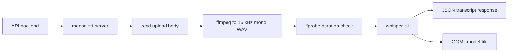

# mensa-stt-server

> Docs: [Main README](../../../README.md) | [Backend README](../../README.md) | [API backend README](../api_backend/README.md) | [Setup README](../../../setup/README.md)

`mensa-stt-server` is the local speech-to-text service for Mensabot. It wraps `whisper.cpp` behind a small FastAPI app and is consumed by the main API backend through `POST /api/transcribe`.

## Transcription Pipeline



## What This Service Does

1. receives raw audio uploads
2. validates upload size
3. converts audio to 16 kHz mono WAV with `ffmpeg`
4. checks the duration with `ffprobe`
5. runs `whisper-cli`
6. extracts a clean transcript from mixed console output
7. returns normalized JSON

This service stays separate from the main API backend because it has different runtime needs: native binaries, heavier CPU usage, model management, and stricter concurrency limits.

## HTTP API

| Route | Method | Purpose |
| --- | --- | --- |
| `/health` | `GET` | Returns status, whisper binary path, model path, and model existence |
| `/transcribe` | `POST` | Accepts raw audio bytes and returns `{ "text": ..., "duration_s": ... }` |

Common failure cases:

- `400` empty request body or invalid audio decode
- `413` upload too large or audio too long
- `422` no speech detected
- `500` missing model or whisper binary
- `504` transcription timed out

## Supported Content Types

Recognized content types include:

- `audio/webm`
- `audio/ogg`
- `audio/mpeg`
- `audio/wav`
- `audio/x-wav`
- `application/octet-stream`

## Configuration

This package reads `STT_*` variables. The API backend setting `API_BACKEND_STT_BASE_URL` is separate and only tells the API backend how to reach this service.

| Variable | Default | Purpose |
| --- | --- | --- |
| `STT_HOST` | `0.0.0.0` | Bind host |
| `STT_PORT` | `9100` | Bind port |
| `STT_WHISPER_BIN` | `/opt/whisper/whisper-cli` | Path to the `whisper.cpp` CLI |
| `STT_MODELS_DIR` | `/models` | Model directory |
| `STT_MODEL` | `small` | Model name resolved as `ggml-<model>.bin` |
| `STT_MODEL_PATH` | unset | Explicit model path override |
| `STT_AUTO_DOWNLOAD_MODEL` | `false` in code | Download missing model automatically when possible |
| `STT_LANGUAGE` | `auto` | Language passed to `whisper-cli -l` |
| `STT_THREADS` | `4` | Whisper thread count |
| `STT_MAX_CONCURRENCY` | `1` | Concurrent transcription jobs |
| `STT_MAX_AUDIO_SECONDS` | `180` | Duration limit |
| `STT_MAX_UPLOAD_BYTES` | `26214400` | Upload size limit |
| `STT_TIMEOUT_S` | `900` | Transcription timeout |

Not every `STT_*` variable appears in the root `.env.example`. That file documents the normal deployment knobs, while the rest rely on code defaults unless you override them.

## Models and Language

The service expects GGML model files compatible with `whisper.cpp`.

By default:

- `STT_MODEL=small` resolves to `/models/ggml-small.bin`
- `STT_MODEL=medium` resolves to `/models/ggml-medium.bin`

Language note:

- models ending in `.en` are English-only
- multilingual German and English use cases should use models without `.en`

## Running It

### Recommended: via Docker

```bash
docker compose up --build stt
```

The Compose setup mounts a persistent `stt_models` volume at `/models`. It does not publish port `9100` to the host by default, because the API backend normally reaches it through the Compose network.

If you want a host-run API backend to reuse the containerized STT service, publish a temporary port and point the API backend at it:

```bash
export API_BACKEND_STT_BASE_URL=http://127.0.0.1:9100
```

### Directly on the host

Requirements:

- a working `whisper.cpp` binary
- `ffmpeg` and `ffprobe`
- a valid model file

Run:

```bash
cd backend/apps/stt_server
uv sync
uv run mensa-stt-server
```

## Docker Image

[`Dockerfile`](Dockerfile) uses a two-stage build:

1. a Debian build stage clones and compiles `whisper.cpp`
2. the runtime image installs `ffmpeg`, copies the `whisper-cli` binary, installs this Python package, and starts `mensa-stt-server`

## Operational Notes

- concurrency stays intentionally conservative because transcription is CPU-heavy
- the service normalizes audio before transcription, so frontend uploads can stay flexible
- the API backend applies its own upload limit and STT concurrency guard in front of this service

## Related README Files

- [Main README](../../../README.md)
- [Backend README](../../README.md)
- [API backend README](../api_backend/README.md)
- [Setup README](../../../setup/README.md)
