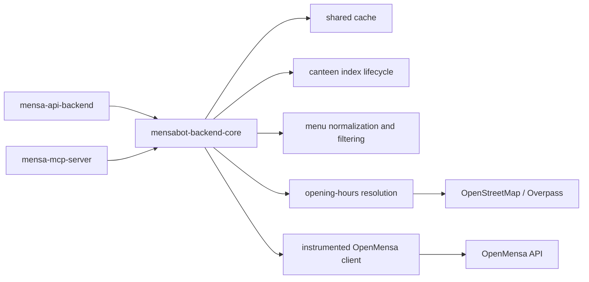
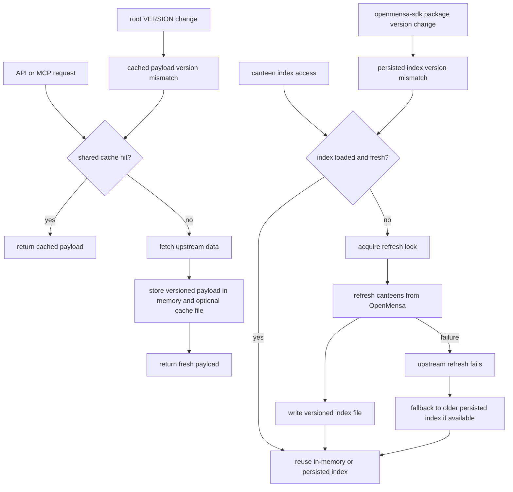

# mensabot-backend-core

> Docs: [Main README](../../../README.md) | [Backend README](../../README.md) | [API backend README](../../apps/api_backend/README.md) | [MCP server README](../../apps/mcp-server/README.md) | [OpenMensa SDK README](../openmensa/README.md)

`mensabot-backend-core` contains the shared backend services used by both the API backend and the MCP package. It is where Mensabot keeps reusable domain logic instead of duplicating behavior across multiple apps.

## Shared Service Layer



## Why This Library Exists

Both top-level backend applications need the same building blocks:

- OpenMensa HTTP access
- canteen index refresh and reuse
- menu normalization and filtering
- OSM / Overpass opening-hours resolution
- shared cache keys and persistence
- metrics collection
- shared runtime settings

This library keeps those concerns in one place so the apps stay thin.

## Main Modules

| Module | Purpose |
| --- | --- |
| `settings.py` | Shared `MENSA_MCP_*` settings model |
| `openmensa_client.py` | Creates instrumented OpenMensa clients with metrics |
| `canteen_index_service.py` | Loads, refreshes, and reuses the persistent canteen index |
| `canteen_service.py` | Fetches and caches single-canteen metadata for shared API and MCP use |
| `menu_service.py` | Normalizes menu dates and applies diet, allergen, and price filtering |
| `opening_hours_service.py` | Resolves canteen opening hours via OSM / Overpass |
| `cache.py` and `cache_keys.py` | Shared TTL cache and stable key generation |
| `metrics.py` | In-process counters used by debug tooling |
| `dto.py` and `mappers.py` | Shared DTOs and mapping helpers |
| `osm/` | Lower-level OSM query, scoring, and resolver logic |

## Shared Configuration

This library reads `MENSA_MCP_*` variables, the same prefix used by `mensa-mcp-server`.

| Setting area | Examples |
| --- | --- |
| OpenMensa | `MENSA_MCP_OPENMENSA_BASE_URL`, `MENSA_MCP_OPENMENSA_TIMEOUT` |
| Overpass | `MENSA_MCP_OVERPASS_URL`, `MENSA_MCP_OVERPASS_TIMEOUT` |
| Canteen index | `MENSA_MCP_CANTEEN_INDEX_PATH`, `MENSA_MCP_CANTEEN_INDEX_TTL_HOURS` |
| Shared cache | `MENSA_MCP_SHARED_CACHE_PATH`, `MENSA_MCP_SHARED_CACHE_DEFAULT_TTL_S` |
| Timezone | `MENSA_MCP_TIMEZONE` |
| IO limits | `MENSA_MCP_IO_MAX_CONCURRENCY` |

The root `.env.example` also contains `API_BACKEND_*` and `STT_*` variables, but those belong to the FastAPI app and the standalone STT service, not to this library itself.

## Core Behaviors

### Cache and Index Lifecycle



### Canteen index lifecycle

- persists on disk when a path is configured
- stays cached in memory once loaded
- refreshes only when stale
- falls back to stale data if refresh fails but an older index exists
- uses a refresh lock to avoid concurrent writes

### Menu handling

- normalizes missing dates to "today" in the configured timezone
- maps OpenMensa errors into stable response statuses
- enriches meals with diet and allergen information
- applies diet, allergen, and price filters
- caches both successful and error responses with different TTLs

### Opening-hours resolution

- resolves a canteen by its OpenMensa coordinates
- queries OSM / Overpass
- returns either a confident match or an ambiguity set
- includes attribution metadata suitable for user-facing output
- caches successful and failing resolutions with different TTLs

## Typical Consumers

This library is usually imported, not run directly.

Example:

```python
from mensabot_backend_core.openmensa_client import make_openmensa_client
from mensabot_backend_core.menu_service import fetch_single_menu
```

Main consumers in this repo:

- [API backend](../../apps/api_backend/README.md)
- [MCP server](../../apps/mcp-server/README.md)

## Maintainer Notes

- keep app-specific response shaping out of this library when possible
- prefer adding reusable DTOs and services here if both the API and MCP packages need them
- keep settings names stable because several packages load the same `MENSA_MCP_*` surface

## Related README Files

- [Main README](../../../README.md)
- [Backend README](../../README.md)
- [API backend README](../../apps/api_backend/README.md)
- [MCP server README](../../apps/mcp-server/README.md)
- [OpenMensa SDK README](../openmensa/README.md)
