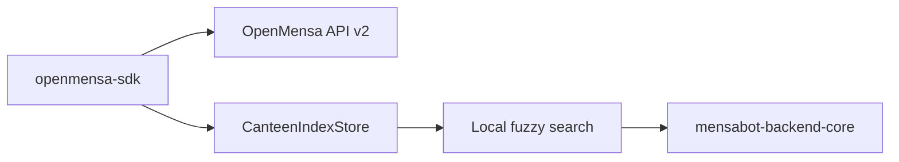

# openmensa-sdk

> Docs: [Main README](../../../README.md) | [Backend README](../../README.md) | [Backend core README](../mensabot-backend-core/README.md) | [MCP server README](../../apps/mcp-server/README.md)

`openmensa-sdk` is a typed Python wrapper around the [OpenMensa API v2](https://openmensa.org/api/v2). In Mensabot it is the lowest-level data access package for canteens, days, and meals, and it also provides the persistent local canteen index used for fast fuzzy search.

## Package Overview



## What This Package Provides

| Piece | Purpose |
| --- | --- |
| `OpenMensaClient` | Synchronous `requests`-based API client |
| typed dataclasses | `Canteen`, `Day`, `Meal`, and price models |
| `to_dict()` helpers | Stable DTO-style serialization for higher layers |
| pagination helpers | Convenience handling for paginated canteen and day endpoints |
| `CanteenIndexStore` | Persistent local index with fuzzy search and distance sorting |
| CLI | Quick manual inspection and debugging commands |

## Installation

From the repository root:

```bash
uv pip install -e backend/libs/openmensa
```

For package development:

```bash
cd backend/libs/openmensa
uv sync
```

## Quick Start

```python
from openmensa_sdk import OpenMensaClient

with OpenMensaClient() as client:
    canteens, _ = client.list_canteens(per_page=20)
    meals = client.list_meals(canteen_id=canteens[0].id, date="2025-11-11")

first_meal = meals[0]
print(first_meal.name, first_meal.prices.to_dict())
```

## Main Client Surface

| Area | Methods |
| --- | --- |
| Canteens | `list_canteens(...)`, `iter_canteens(...)`, `get_canteen(canteen_id)` |
| Days | `list_days(canteen_id, ...)` |
| Meals | `list_meals(canteen_id, date)`, `get_meal(canteen_id, date, meal_id)` |
| Errors | `OpenMensaAPIError` with status code, URL, and response body when available |

Supported canteen lookup patterns include:

- OpenMensa pagination
- proximity filtering with `near_lat`, `near_lng`, and `near_dist`
- ID filtering
- coordinate availability filtering

## `CanteenIndexStore`

One of the most important features for Mensabot is `CanteenIndexStore`. It builds and persists a local snapshot of OpenMensa canteens and adds a fuzzy search layer on top.

Capabilities:

- refresh from the upstream API
- persist to disk
- paginate local canteen listings
- fuzzy name search
- city filtering
- distance-aware result ordering
- alias handling for abbreviations such as `TU`, `FU`, `HU`, `FH`, `HS`, and `TH`

Default path behavior:

- if `OPENMENSA_CANTEEN_INDEX_PATH` is set, the store uses that file
- otherwise it falls back to an XDG-style cache path under `~/.cache/openmensa/canteens.json`

## CLI Usage

The package ships with an `openmensa` CLI.

```bash
cd backend/libs/openmensa
uv sync
uv run openmensa --help
```

Examples:

```bash
uv run openmensa list-canteens --per-page 10
uv run openmensa list-canteens --near-lat 52.512 --near-lng 13.326 --near-dist 2.0
uv run openmensa get-canteen --id 2019
uv run openmensa list-days --canteen-id 2019
uv run openmensa list-meals --canteen-id 2019 --date 2025-11-11
uv run openmensa get-meal --canteen-id 2019 --date 2025-11-11 --meal-id 12345
uv run openmensa index-refresh
uv run openmensa index-list --city Berlin --per-page 20
uv run openmensa index-search --query "tu berlin" --limit 5
```

## Defaults and Integration Notes

- default base URL: `https://openmensa.org/api/v2`
- default timeout: `10.0` seconds
- default user agent: derived from the root `VERSION` file through `mensabot-common`
- primary consumer inside this repo: [`mensabot-backend-core`](../mensabot-backend-core/README.md)

## Related README Files

- [Main README](../../../README.md)
- [Backend README](../../README.md)
- [Backend core README](../mensabot-backend-core/README.md)
- [MCP server README](../../apps/mcp-server/README.md)
