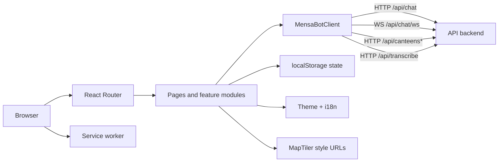
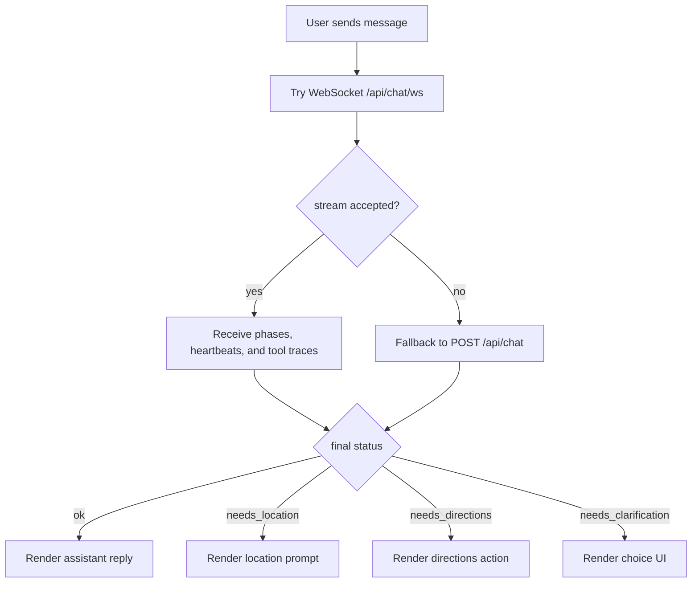

# Mensabot Frontend

<p align="center">
  
</p>

> Docs: [Main README](../README.md) | [Setup README](../setup/README.md) | [Backend README](../backend/README.md)

React + TypeScript + Vite web client for Mensabot. It owns the conversational UI, canteen browsing, maps, saved shortcuts, install prompts, and browser-side persistence.

## At a Glance

| Area | Details |
| --- | --- |
| Framework | React 19 + TypeScript 5 |
| Build tool | Vite 7 |
| Styling | `styled-components` |
| Routing | `react-router-dom` |
| i18n | `i18next` + `react-i18next` |
| Maps | `maplibre-gl` |
| PWA | `vite-plugin-pwa` with `injectManifest` |
| Production runtime | Static build served on port `8080` inside Docker |
| Environment source | root `.env`, because `vite.config.ts` uses `envDir: "../"` |

## Frontend Architecture



## User-Facing Responsibilities

- landing page and primary navigation
- chat UI with filters, streaming updates, clarification flows, and voice input
- canteen search and browsing
- interactive map page
- reusable prompt shortcuts
- install prompts and offline fallback behavior
- theme, language, onboarding, and local data management

## Routes

| Route | Purpose |
| --- | --- |
| `/` | Landing page |
| `/chat` | Main chat interface |
| `/canteens` | Search and browse canteens |
| `/map` | Interactive map view |
| `/shortcuts` | Manage saved prompt shortcuts |
| `/settings` | Language, install, onboarding, and storage actions |
| `/about` | Project facts and statistics |
| `/legal` | Legal notice page |

## Package Structure

```text
frontend/
|-- public/                      Static assets, icons, offline fallback page
|-- src/
|   |-- app/                     App bootstrap, routing, i18n
|   |-- assets/                  Logos and UI graphics
|   |-- features/                Chat, install prompts, shell, shortcuts
|   |-- layouts/                 Shared app shell
|   |-- locales/                 German and English translations
|   |-- pages/                   Route-level pages
|   |-- shared/                  API client, theme, UI primitives, helpers
|   |-- main.tsx                 React entry point
|   `-- service-worker.ts        PWA service worker source
|-- Dockerfile                   Production build and static serving image
|-- package.json                 Scripts and dependencies
`-- vite.config.ts               Vite config, proxy, aliases, PWA setup
```

## Local Development

1. Create the root environment file if it does not already exist.

```bash
cp .env.example .env
```

2. Keep or set the API base path in the root `.env`.

```dotenv
VITE_API_BASE_URL=/api
```

3. Set the map style URLs if you want the map page to work.

```dotenv
VITE_MAPTILER_STYLE_URL_LIGHT=...
VITE_MAPTILER_STYLE_URL_DARK=...
```

4. Install dependencies and start the Vite dev server.

```bash
cd frontend
npm ci
npm run dev
```

5. Make sure the API backend is reachable on `http://localhost:8000`.

By default the Vite dev server proxies `/api` to `http://localhost:8000`, including WebSocket traffic for `/api/chat/ws`.

Backend details: [Backend README](../backend/README.md)

## Environment Variables

All frontend-facing variables are consumed at build time.

| Variable | Required | Purpose |
| --- | --- | --- |
| `VITE_API_BASE_URL` | Recommended | Base path for backend calls. The default repo setup uses `/api`. |
| `VITE_MAPTILER_STYLE_URL_LIGHT` | Required for map page | Light-mode MapTiler style JSON URL |
| `VITE_MAPTILER_STYLE_URL_DARK` | Required for map page | Dark-mode MapTiler style JSON URL |

Important notes:

- Vite reads these values from the repository root because `vite.config.ts` sets `envDir: "../"`.
- Production changes require a rebuild.
- The Docker build receives these values as build arguments from the root `docker-compose.yml`.

## API Integration

The frontend does not talk to the backend through hardcoded absolute URLs. It builds requests from `VITE_API_BASE_URL`.

With the default `/api` value, the important runtime endpoints are:

| Transport | Endpoint |
| --- | --- |
| HTTP chat fallback | `POST /api/chat` |
| WebSocket chat stream | `WS /api/chat/ws` |
| Voice transcription | `POST /api/transcribe` |
| Canteen listing and search | `GET /api/canteens*` |

The chat layer supports four backend-driven response states:

- `ok`
- `needs_location`
- `needs_directions`
- `needs_clarification`

## Interaction Flow



## Browser Persistence

Most user-specific state is stored in `localStorage`.

| Key | Purpose |
| --- | --- |
| `mensabot-chats-index` | Chat ordering and metadata |
| `mensabot-active-chat-id` | Currently selected chat |
| `chat-*` | Serialized chat bodies |
| `mensabot-shortcuts` | Saved shortcuts |
| `mensabot-onboarding-completed` | Onboarding completion flag |
| `mensabot-chat-mode` | Selected chat mode (`reliable` or `fast`) |
| `theme` | Theme preference (`light`, `dark`, `system`) |
| `mensabot-install-promotion` | Install-prompt state and cooldowns |

Implications:

- chats and shortcuts are browser-local, not server-side
- clearing site data resets the frontend state
- the settings page can clear chats and restart onboarding

## PWA and Offline Behavior

The frontend uses `vite-plugin-pwa` with an `injectManifest` setup.

Current behavior:

- the service worker is registered in production builds
- navigations use the app shell and explicitly exclude `/api`
- static assets use a stale-while-revalidate strategy
- `public/offline.html` is used as the offline fallback document
- install prompts support both native browser prompts and manual Safari instructions

## Build and Docker

### Production build

```bash
cd frontend
npm ci
npm run build
```

The build output is written to `frontend/dist`.

### Docker image

[`Dockerfile`](./Dockerfile) uses a two-stage Node 20 Alpine setup:

1. install dependencies and build the static app
2. serve `dist/` with `serve` on port `8080`

## Troubleshooting

### The map page shows a configuration error

Set both of these variables in the root `.env`:

- `VITE_MAPTILER_STYLE_URL_LIGHT`
- `VITE_MAPTILER_STYLE_URL_DARK`

### The frontend cannot reach the backend locally

Check all of the following:

- the backend is running on `http://localhost:8000`
- `VITE_API_BASE_URL=/api` is set in the root `.env`
- the frontend was restarted after environment changes

### Voice input fails in local development

The chat UI works without the STT service, but voice input does not. Make sure the API backend can reach a running STT service. The backend and STT setup details live here:

- [Backend README](../backend/README.md)
- [STT server README](../backend/apps/stt_server/README.md)

### The app looks stale after deployment

The service worker may still have an older cached shell. Hard refresh the app or unregister the old service worker while debugging.

## Related README Files

- [Main README](../README.md)
- [Setup README](../setup/README.md)
- [Backend README](../backend/README.md)
- [STT server README](../backend/apps/stt_server/README.md)
