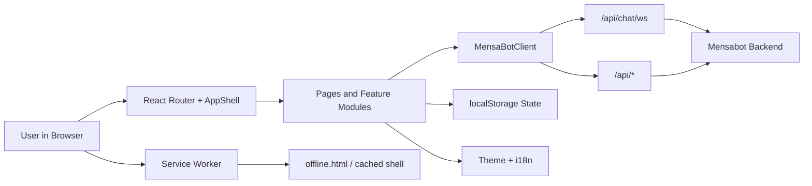

# Mensabot Frontend

<p align="center">
  
</p>

<p align="center">
  React + TypeScript + Vite web client for the Mensabot canteen assistant.
</p>

This README focuses on the frontend package in `frontend/`. For the full stack architecture, backend, Docker deployment, and operational setup, see the main repository README at [`../README.md`](../README.md).

## Overview

The Mensabot frontend is the browser-facing part of the project. It combines a conversational UI, classic canteen search, a map view, reusable prompt shortcuts, installable PWA behavior, and bilingual UX in one client application.

The app is designed to work well in two contexts:

- local development with the Vite dev server and a locally running backend
- production deployment behind Nginx, where the compiled frontend is served as a static app and talks to the backend through `/api`

## What The Frontend Does

- Provides the landing page and the main chat workflow
- Persists chat history, shortcuts, onboarding progress, theme, and install-prompt state in the browser
- Streams chat progress over WebSocket when available, with HTTP fallback
- Supports voice input through the backend transcription endpoint
- Lets users browse and search OpenMensa-backed canteens
- Shows canteens on an interactive MapLibre map
- Offers install prompts and offline fallback behavior as a PWA
- Supports German and English via `i18next`

## Pages And Routes

| Route | Purpose |
| --- | --- |
| `/` | Landing page with project entry point and high-level feature overview |
| `/chat` | Main chat interface with onboarding, filters, shortcuts, streaming replies, and voice input |
| `/canteens` | Search and browse canteens with sorting, distance hints, and direct handoff into chat |
| `/map` | Interactive map view of canteens using MapLibre and theme-specific MapTiler styles |
| `/shortcuts` | Create, edit, and delete reusable prompt shortcuts with saved filters |
| `/settings` | Language switching, install entry, onboarding reset, and chat cleanup |
| `/about` | Project facts and live canteen/city statistics |
| `/legal` | Legal notice page |

## Feature Highlights

### Chat Experience

- Natural-language chat against the Mensabot backend
- Two chat modes:
  - `reliable`: enables judge/correction behavior on the backend side
  - `fast`: prioritizes lower latency
- Filter-aware prompts for diet, allergens, canteens, and price categories
- Structured follow-up flows for:
  - location requests
  - clarification prompts
  - directions prompts
- Reusable shortcuts that combine a prompt template with filter presets
- Slash-command style menu lookup for canteens, for example:
  - `/hauptmensa`
  - `/hauptmensa heute`
  - `/hauptmensa morgen`
  - `/hauptmensa 31.03.2026`

### Canteen Discovery

- Search-based canteen browsing with infinite scrolling
- Sorting by recommendation, name, city, or distance
- Direct selection of a canteen to start a chat with that canteen preselected
- Google Maps handoff for route opening

### Map Experience

- MapLibre-based interactive map
- Separate light and dark style URLs
- Search/filtering inside the map page
- Clear error states when map style URLs are missing

### PWA And Offline Behavior

- Installable web app behavior through `vite-plugin-pwa`
- Service worker with app shell caching and offline document fallback
- Native install prompts where supported
- Manual install instructions for Safari on iOS/iPadOS and macOS
- Online/offline detection with UI fallbacks

## Tech Stack

| Area | Technology |
| --- | --- |
| UI framework | React 19 |
| Language | TypeScript 5 |
| Build tool | Vite 7 |
| Styling | `styled-components` |
| Routing | `react-router-dom` |
| i18n | `i18next`, `react-i18next`, `i18next-browser-languagedetector` |
| Maps | `maplibre-gl` |
| Markdown rendering | `react-markdown`, `remark-gfm`, `rehype-raw`, `rehype-sanitize` |
| PWA | `vite-plugin-pwa`, Workbox |
| Linting | ESLint flat config + `typescript-eslint` |

## Architecture At A Glance



### Key Architectural Notes

- Routes are lazy-loaded in [`src/app/App.tsx`](./src/app/App.tsx) to keep the initial bundle smaller.
- The shared shell in [`src/layouts/AppShell/AppShell.tsx`](./src/layouts/AppShell/AppShell.tsx) owns navigation, responsive layout, recent chats, install prompts, and offline banners.
- API access is centralized through [`src/shared/api/MensaBotClient.ts`](./src/shared/api/MensaBotClient.ts).
- Chat state is persisted in browser storage via [`src/features/chat/model/chatStore.ts`](./src/features/chat/model/chatStore.ts).
- The service worker in [`src/service-worker.ts`](./src/service-worker.ts) caches the app shell and static assets, but intentionally excludes `/api`.

## Project Structure

```text
frontend/
|-- public/                      Static public assets and offline fallback page
|-- src/
|   |-- app/                     App bootstrap, routes, i18n
|   |-- assets/                  Images, logos, icons
|   |-- features/
|   |   |-- chat/                Chat UI, chat controller, storage, streaming
|   |   |-- install/             PWA install prompts and instructions
|   |   |-- shell/               Header, sidebar, navigation helpers
|   |   `-- shortcuts/           Shortcut CRUD and modal UI
|   |-- layouts/                 Shared app shell and outlet context
|   |-- locales/                 German and English translations
|   |-- pages/                   Route-level pages
|   |-- shared/                  API client, theme, UI primitives, helpers
|   |-- index.css                Global base styles
|   |-- main.tsx                 React entry point
|   `-- service-worker.ts        PWA service worker entry
|-- Dockerfile                   Production image build for the frontend
|-- eslint.config.js             Flat ESLint config
|-- package.json                 Scripts and dependencies
`-- vite.config.ts               Vite config, proxy, aliases, PWA setup
```

## Getting Started

### Prerequisites

- Node.js 20
- npm
- a running Mensabot backend for chat/search/transcription features

### Important Environment Detail

This frontend uses `envDir: "../"` in [`vite.config.ts`](./vite.config.ts), which means Vite reads environment variables from the repository root, not from `frontend/.env`.

In practice, use the root `.env` file:

```bash
cp .env.example .env
```

### Local Development

1. Configure the root `.env`.

At minimum, keep or set:

```dotenv
VITE_API_BASE_URL=/api
```

Optional, but required for the map page:

```dotenv
VITE_MAPTILER_STYLE_URL_LIGHT=...
VITE_MAPTILER_STYLE_URL_DARK=...
```

2. Start the backend.

Use the instructions from [`../README.md`](../README.md). For example, local development commonly uses the backend on `http://localhost:8000`.

3. Install frontend dependencies.

```bash
cd frontend
npm ci
```

4. Start the Vite development server.

```bash
npm run dev
```

5. Open the app:

```text
http://localhost:5173
```

### Development Networking

- The Vite dev server proxies `/api` to `http://localhost:8000`.
- The frontend expects `VITE_API_BASE_URL=/api` for both local development and the default Nginx deployment.
- Chat streaming uses WebSocket when possible and falls back to regular HTTP if the stream is unavailable.

## Available Scripts

| Command | What it does |
| --- | --- |
| `npm run dev` | Starts the local Vite dev server |
| `npm run build` | Runs `tsc -b` and creates the production build |
| `npm run lint` | Runs ESLint across the frontend codebase |
| `npm run preview` | Serves the built app locally with Vite preview |

Recommended pre-merge checks:

```bash
npm run lint
npm run build
```

## Environment Variables

All frontend-facing variables are consumed at build time.

| Variable | Required | Purpose |
| --- | --- | --- |
| `VITE_API_BASE_URL` | Recommended | Base path for backend calls. Use `/api` in local dev and in the default deployment. |
| `VITE_MAPTILER_STYLE_URL_LIGHT` | Required for map page | Full light-mode MapTiler Style JSON URL. |
| `VITE_MAPTILER_STYLE_URL_DARK` | Required for map page | Full dark-mode MapTiler Style JSON URL. |

### Notes

- If the map style URLs are missing, the rest of the app still works, but the map page shows a configuration error state.
- Because these are Vite variables, changing them requires a rebuild for production output.
- In Docker builds, the values are passed into the image through build args in the root `docker-compose.yml`.

## State, Persistence, And Browser Storage

The frontend stores most user-specific state in `localStorage`.

| Key | Purpose |
| --- | --- |
| `mensabot-chats-index` | Index of saved chats and ordering metadata |
| `mensabot-active-chat-id` | Currently selected chat |
| `chat-*` | Serialized chat contents by chat id |
| `mensabot-shortcuts` | Saved shortcuts |
| `mensabot-onboarding-completed` | Onboarding completion flag |
| `mensabot-chat-mode` | Selected chat mode (`fast` or `reliable`) |
| `theme` | User theme preference (`light`, `dark`, or `system`) |
| `mensabot-install-promotion` | Install prompt/session tracking state |

Implications:

- chat history and shortcuts are browser-local, not server-side
- clearing site storage removes frontend state
- the settings page includes actions to clear chats and restart onboarding

## PWA, Service Worker, And Offline Support

The frontend uses `vite-plugin-pwa` with an `injectManifest` setup.

Current behavior:

- the app registers the service worker only in production builds
- navigation requests use the app shell (`/index.html`)
- `/api` routes are explicitly excluded from app-shell routing
- static assets are cached with a stale-while-revalidate strategy
- `public/offline.html` is used as the offline fallback page when no app shell is available

This keeps the UI installable and resilient for navigation, while live canteen/chat data still depends on backend availability.

## Theming And Internationalization

### Theming

- Implemented through `styled-components`
- Supports `light`, `dark`, and `system`
- The active theme follows OS preference when the user leaves the app in `system` mode

### Internationalization

- Languages currently shipped: German and English
- Language detection uses the browser via `i18next-browser-languagedetector`
- Translation resources live in:
  - [`src/locales/de/translation.json`](./src/locales/de/translation.json)
  - [`src/locales/en/translation.json`](./src/locales/en/translation.json)

## Chat Integration Details

The frontend does more than render plain text responses. The chat layer is structured around backend-driven interaction states.

### Transport

- WebSocket stream endpoint: `/chat/ws` under the configured API base
- HTTP fallback endpoint: `POST /chat`

### Supported Interaction States

- normal assistant replies
- location prompts
- directions prompts
- clarification prompts
- tool-call tracing and progressive stream state updates

### Filter Model

The chat filter UI can constrain responses by:

- diet
- allergens
- selected canteens
- price category

### Voice Input

Voice input goes through the backend transcription endpoint at `/api/transcribe`.

Text chat works without the STT service. Voice input requires the backend to be able to reach the transcription service.

## Build And Deployment

### Production Build

```bash
cd frontend
npm ci
npm run build
```

The build output is generated in `frontend/dist`.

### Docker Image

[`Dockerfile`](./Dockerfile) uses a two-stage Node 20 Alpine build:

1. install dependencies and build the static app
2. serve `dist/` via `serve` on port `8080`

The root Compose setup passes these build args into the frontend image:

- `VITE_API_BASE_URL`
- `VITE_MAPTILER_STYLE_URL_LIGHT`
- `VITE_MAPTILER_STYLE_URL_DARK`

If any of these values change, rebuild the frontend image.

## Development Notes

- Import alias `@/` resolves to `src/`.
- The codebase uses strict TypeScript settings in bundler mode.
- ESLint is configured with the flat config format.
- Routes and top-level pages are code-split with `React.lazy`.
- There is currently no dedicated frontend test suite checked into the repository, so `lint` and `build` are the main automated checks for this package.

## Troubleshooting

### The map page shows a configuration error

Set both of these variables in the root `.env`:

- `VITE_MAPTILER_STYLE_URL_LIGHT`
- `VITE_MAPTILER_STYLE_URL_DARK`

### The frontend cannot reach the backend in local development

Check all of the following:

- the backend is running on `http://localhost:8000`
- `VITE_API_BASE_URL=/api` is set in the root `.env`
- the frontend was restarted after environment changes

### Voice input does not work locally

Text chat does not need STT, but voice input does. Make sure the backend can reach the STT service. The root README documents the local-dev STT setup and temporary port mapping approach.

### The app looks stale after a deployment

The service worker may still have an older cached shell. Hard refresh the app, or unregister the old service worker during debugging.

### Chats or shortcuts disappeared

They are stored locally in the browser. Clearing site data or using a different browser/profile creates a clean frontend state.

## Dependency Audit Note

- Do not run `npm audit fix --force` in this package.
- The remaining audit findings are tied to the current `vite-plugin-pwa` and Workbox chain used with the Vite 7 setup.
- Safe lockfile and compatible dependency refreshes are fine, but forced downgrade paths are not appropriate here.

## Related Documentation

- [`../README.md`](../README.md): full repository overview and local/backend setup
- [`../SETUP_README.md`](../SETUP_README.md): interactive setup and deployment workflow
- [`../backend/apps/stt_server/README.md`](../backend/apps/stt_server/README.md): speech-to-text service details
