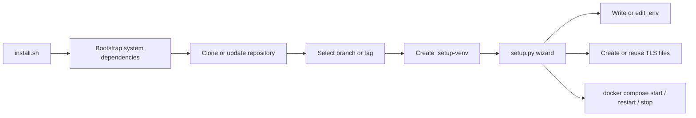

# Mensabot Setup

<p align="center">
  
</p>

> Docs: [Main README](../README.md) | [Frontend README](../frontend/README.md) | [Backend README](../backend/README.md)

The `setup/` directory contains the interactive deployment workflow for Mensabot: the setup wizard, the TLS helper script, and the Python dependencies used by the wizard itself.

## What This Path Is For

Use this path when you want:

- guided first-time deployment on a server or VM
- interactive editing of `.env` without opening the file manually
- guided TLS handling for the default Nginx setup
- version and branch selection before deployment or update
- a repeatable operations menu for start, stop, restart, and update actions

The workflow is designed for interactive terminals and works best on Debian or Ubuntu style hosts.

## Setup Flow



## Recommended Entry Points

For a fresh server or VM:

```bash
curl -sSL https://raw.githubusercontent.com/tobiasv1337/Mensabot/main/install.sh | bash
```

If the repository already exists locally:

```bash
bash install.sh
```

Re-running the installer is expected. It is the supported way to reopen the management menu later.

## What `install.sh` Actually Does

1. Checks for basic tools such as `curl`, `git`, `python3`, and `python3-venv`.
2. Installs missing dependencies on Debian or Ubuntu systems when possible.
3. Installs Docker if it is not already available.
4. Detects an existing Mensabot checkout or clones one.
5. Lets you choose a branch or release tag before configuration.
6. Creates a dedicated `.setup-venv`.
7. Installs the setup UI dependencies from [`requirements.txt`](requirements.txt).
8. Launches [`setup.py`](setup.py).

Operational notes:

- the script expects an interactive terminal
- it can be started as `root` or through `sudo`
- it can add the primary user to the `docker` group when that is required for the workflow

## Wizard States

The wizard changes its actions based on the current deployment state.

| State | Meaning | Main actions |
| --- | --- | --- |
| Initial setup | No `.env` file exists yet | select version, initial configuration |
| Configured, stopped | `.env` exists but no services are running | deploy, reconfigure, update version |
| Running | Compose services are active | restart, reconfigure, update version, stop |

## Configuration Modes

The wizard reads [`../.env.example`](../.env.example) directly and uses it as the source of defaults, categories, and descriptions.

| Mode | Best for | What it covers |
| --- | --- | --- |
| Express setup | Fastest route to a working deployment | LLM credentials, map styles, basic auth, TLS hostnames, whisper model |
| Advanced setup | Full control over all documented settings | every category defined in `.env.example` |

Because the categories are loaded from `.env.example`, the advanced flow stays aligned with the real configuration surface as that file evolves.

## TLS and HTTPS

The default Nginx image expects certificate files at:

- `nginx/certs/selfsigned.crt`
- `nginx/certs/selfsigned.key`

If those files are missing, the setup wizard can generate a self-signed development certificate before starting the stack.

The helper script is [`create-dev-cert.sh`](create-dev-cert.sh). By default it covers:

- `localhost`
- `127.0.0.1`

If you want the generated certificate to match a public hostname or IP, configure:

- `MENSABOT_TLS_CN`
- `MENSABOT_TLS_SANS`

If you already have a trusted certificate, replace the expected files with your real certificate and private key content instead of using the development helper.

## Version Selection and Updates

Version selection exists in two places:

| Where | What happens |
| --- | --- |
| `install.sh` before setup | lets you choose a remote branch or tag before clone or update |
| `Update Mensabot Version` inside the wizard | fetches refs from `origin`, checks out the chosen ref, updates branches, and returns to deployment actions |

This makes the setup flow usable both for first deployment and for later upgrades.

## Deployment Actions

| Action | Behavior |
| --- | --- |
| Start / Deploy | validates TLS files, generates a development cert if needed, then runs `docker compose up -d --build` |
| Restart | runs `docker compose down`, rechecks TLS, then runs `docker compose up -d --build` |
| Stop | runs `docker compose down` |

## Files in This Directory

| Path | Purpose |
| --- | --- |
| [`setup.py`](setup.py) | Interactive setup, deployment, and update wizard |
| [`create-dev-cert.sh`](create-dev-cert.sh) | Generates the development TLS certificate expected by the Nginx image |
| [`requirements.txt`](requirements.txt) | Python dependencies for the wizard UI |

## When to Skip This Workflow

If you prefer to manage `.env`, TLS, and Docker Compose yourself, use the manual path from the main README instead:

- [Main README](../README.md)

For local frontend work or package-level backend development, the more specific docs are usually a better starting point:

- [Frontend README](../frontend/README.md)
- [Backend README](../backend/README.md)
